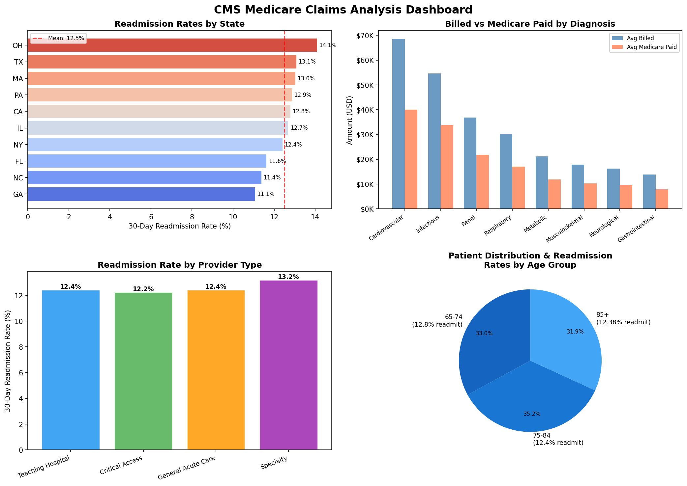

# Healthcare Claims SQL Analysis

**Portfolio project — Radhika Mujumdar**  
End-to-end analysis of CMS Medicare-style claims data using SQL, Python, and Power BI/Tableau exports.

---

## Overview

| Item | Detail |
|---|---|
| Dataset | Synthetic CMS Medicare-style claims (1,000 records, 50 providers) |
| Structure | Mirrors real CMS Medicare Provider Utilization data (data.cms.gov) |
| Tools | Python, SQLite, Pandas, Matplotlib, Seaborn, Power BI, Tableau |
| Skills demonstrated | SQL querying, healthcare data analysis, cost driver identification, data visualization, BI tool export |
> **Note:** Synthetically generated for portfolio purposes. No real patient data is used.

---

## Key findings

- **Ohio** had the highest 30-day readmission rate at **14.1%** — 1.6 points above the national mean
- **Cardiovascular** was the highest-cost diagnosis at **~$68K avg billed**, with a significant gap vs Medicare reimbursement
- **Specialty hospitals** had the highest readmission rate (13.2%); **Critical Access** had the lowest (12.2%)
- **85+ patients** showed the highest readmission vulnerability across all age groups

---

## Project structure

```
healthcare-claims-analysis/
├── data/
│   ├── generate_data.py        # Generates synthetic SQLite database
│   └── claims.db               # Auto-generated — not committed to Git
├── sql/
│   └── analysis_queries.sql    # All 6 SQL queries with comments and insights
├── outputs/
│   ├── cms_dashboard.png       # 4-panel Matplotlib/Seaborn dashboard
│   ├── claims_powerbi.xlsx     # Excel workbook for Power BI / Tableau
│   ├── claims_flat.csv         # Denormalized flat file for BI tools
│   └── summary_by_*.csv        # Pre-aggregated summary tables
├── analysis.py                 # Main analysis script (SQL queries + dashboard)
├── export_powerbi.py           # Exports CSV + Excel for Power BI / Tableau
├── requirements.txt
└── README.md
```

---

## How to run

**1. Clone and install**
```bash
git clone https://github.com/RadhikaMujumdar/healthcare-claims-analysis.git
cd healthcare-claims-analysis
pip install -r requirements.txt
```

**2. Generate the database**
```bash
python data/generate_data.py
```

**3. Run the analysis and build the dashboard**
```bash
python analysis.py
```

**4. Export for Power BI / Tableau**
```bash
python export_powerbi.py
```

---

## SQL queries covered

| # | Query | Insight |
|---|---|---|
| 1 | 30-day readmission rate by state | Ohio highest at 14.1% |
| 2 | Cost drivers by diagnosis category | Cardiovascular ~$68K avg billed |
| 3 | Performance by provider type | Teaching hospitals bill most; Critical Access readmit least |
| 4 | Readmission rate by age group | 85+ most vulnerable |
| 5 | Year-over-year payment trends | Medicare payment shifts 2021–2023 |
| 6 | Top 10 highest-cost providers | Provider-level cost outlier detection |

---

## Dashboard



---

## Power BI / Tableau

The `export_powerbi.py` script generates:
- **`claims_powerbi.xlsx`** — 6-sheet Excel workbook, load directly into Power BI Desktop or Tableau
- **`claims_flat.csv`** — full denormalized dataset for custom BI visuals

**Power BI:** Home → Get Data → Excel → `claims_powerbi.xlsx` → select all sheets → Load  
**Tableau:** Connect → Text File → `claims_flat.csv`

---

## About

Built to demonstrate end-to-end healthcare analytics skills: data modeling → SQL query design → Python analysis → visualization → BI tool export. Dataset is synthetic but mirrors real CMS Medicare Provider Utilization data structure.
